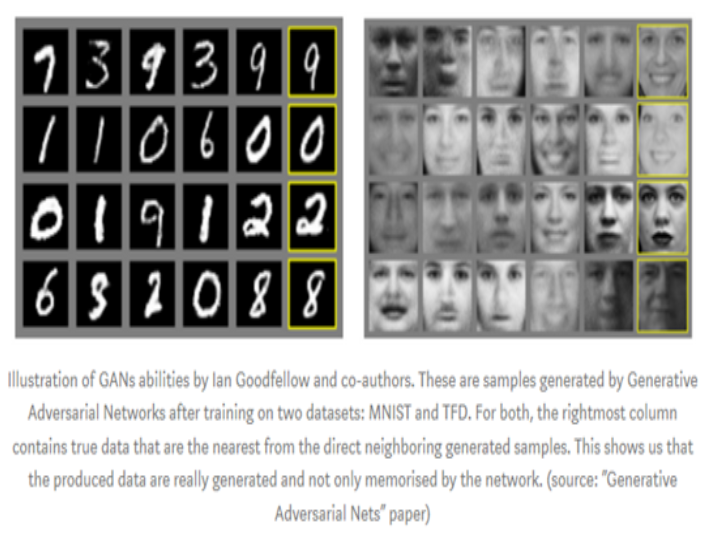
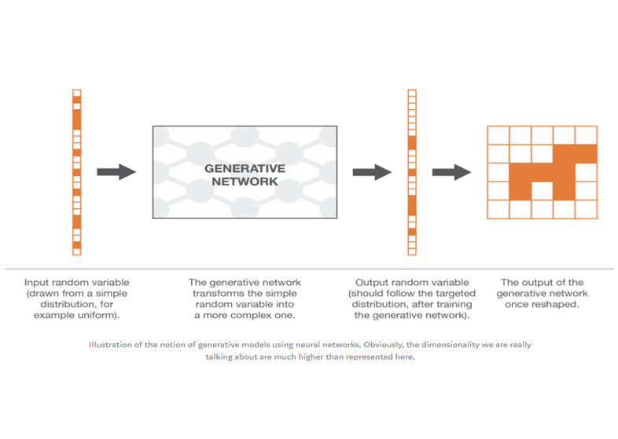
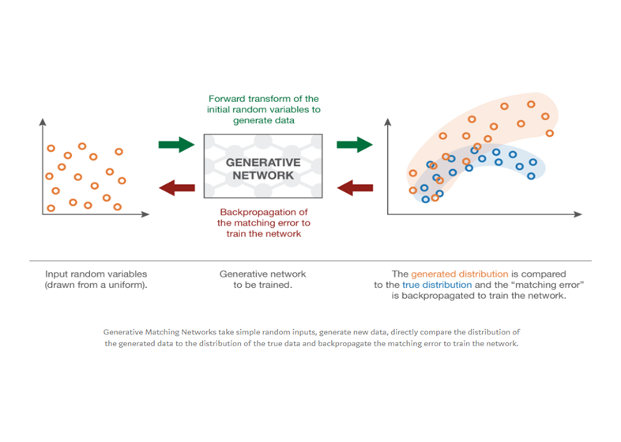
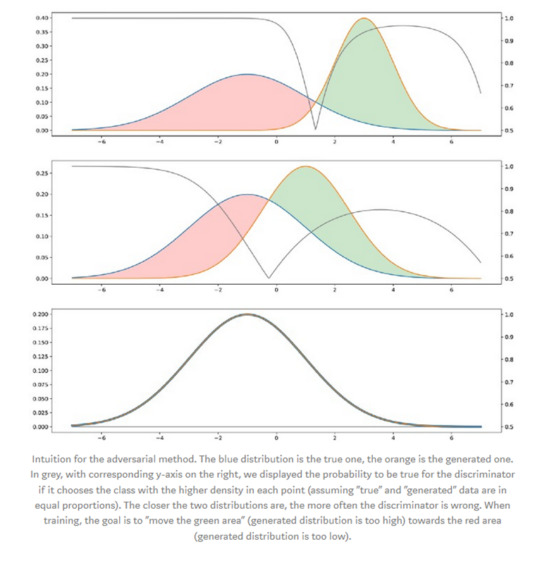
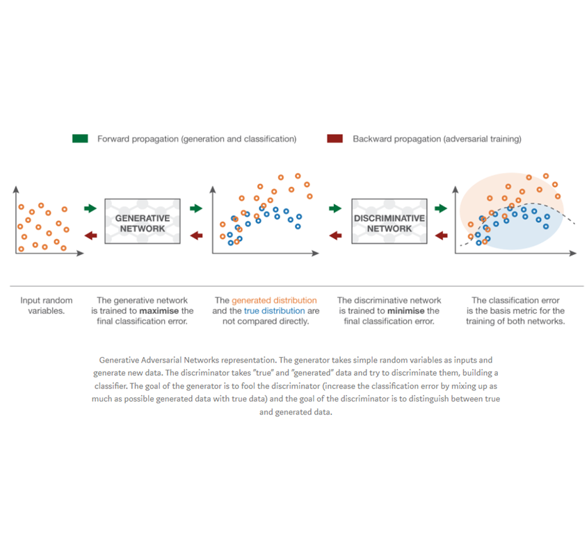
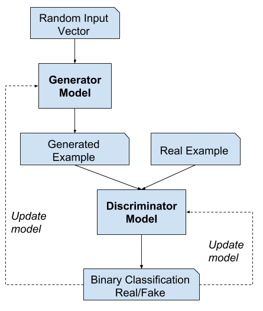

# GAN_with_Tf2
NOTE: Either Run in Google Collab (With GPU), or download the repos

 
Generative modelling is an unsupervised learning task in machine learning that involves automatically discovering and learning the regularities or patterns in input data in such a way that the model can be used to generate or output new examples that plausibly could have been drawn from the original dataset.

GANs are a clever way of training a generative model by framing the problem as a supervised learning problem with two sub-models: the generator model that we train to generate new examples, and the discriminator model that tries to classify examples as either real (from the domain) or fake (generated). The two models are trained together in a zero-sum game, adversarial, until the discriminator model is fooled about half the time, meaning the generator model is generating plausible examples.

GANs are an exciting and rapidly changing field, delivering on the promise of generative models in their ability to generate realistic examples across a range of problem domains, most notably in image-to-image translation tasks such as translating photos of summer to winter or day to night, and in generating photorealistic photos of objects, scenes, and people that even humans cannot tell are fake.

The “indirect” training method
The downstream task of GANs is a discrimination task between true and generated samples. Or we could say a “non-discrimination” task as we want the discrimination to fail as much as possible. So, in a GAN architecture, we have a discriminator, that takes samples of true and generated data and that try to classify them as well as possible, and a generator that is trained to fool the discriminator as much as possible.

The ideal case: perfect generator and discriminator
In order to better understand why training a generator to fool a discriminator will lead to the same result as training directly the generator to match the target distribution, let’s take a simple one dimensional example. We forget, for the moment, how both generator and discriminator are represented and consider them as abstract notions (that will be specified in the next subsection). Moreover, both are supposed “perfect” (with infinite capacities) in the sense that they are not constrained by any kind of (parametrised) model.

If the two distributions are far appart, the discriminator will be able to classify easily and with a high level of confidence most of the points we present to it. If we want to fool the discriminator, we have to bring the generated distribution close to the true one. The discriminator will have the most difficulty to predict the class when the two distributions will be equal in all points: in this case, for each point there are equal chances for it to be “true” or “generated” and then the discriminator can’t do better than being true in one case out of two in average.

GANs typically work with image data and use Convolutional Neural Networks, or CNNs, as the generator and discriminator models.
The reason for this may be both because the first description of the technique was in the field of computer vision and used CNNs and image data, and because of the remarkable progress that has been seen in recent years using CNNs more generally to achieve state-of-the-art results on a suite of computer vision tasks such as object detection and face recognition.
Modelling image data means that the latent space, the input to the generator, provides a compressed representation of the set of images or photographs used to train the model. It also means that the generator generates new images or photographs, providing an output that can be easily viewed and assessed by developers or users of the model.
It may be this fact above others, the ability to visually assess the quality of the generated output, that has both led to the focus of computer vision applications with CNNs and on the massive leaps in the capability of GANs as compared to other generative models, deep learning based or otherwise

